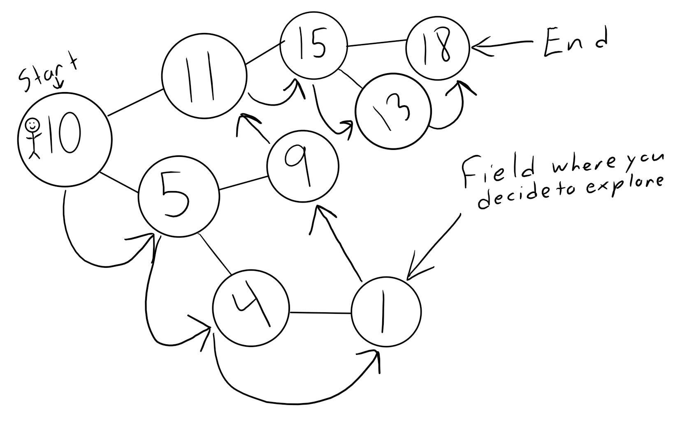

# 240TestPrep
Get dat practice in

Hi! If you're here you're probably trying to get ready for the CS240 final. Before we go any further though I'd like to share a few tips!
- Take a deep breath and relax and know that you can do it!
- Stop trying to memorize every little bit of syntax and start trying to understand concepts. Syntax is useless if you don't know
  how to use it!
- Don't try to make your code needlessly complex, no need to spend time implementing mergesort when your data set consists of 2 values.

##Background info
So what is a binary tree? Imagine that you are playing a game and you start in an field with a massive number 10 in the middle of it. From this field you see that there is only two paths out, 
one to your left and the other to your right. Although they both lead to totally new areas you've never been to before. You decide to take the left path 
and arrive in another field but this time there is a massive number 5 in the middle of it. From the field you currently see that there are another two paths 
you can choose from to continue. You continue shoosing the left path always ending up in a new field with a large number in it. You eventually reach 
a field that does not contain any paths to new fields. You then decide you want to search through every field by going to previous nodes until there is a right path you can go down and then search all right paths leading from that one and repeat until you've gone though every field there is.

Your story sucks, what does any of this mean?
Great question!
Think of the follwing things in the story as the following:
- First field - Root node of a tree
- Left and right paths - Pointers to left and right child nodes of a node in the tree
- Field without any paths - Leaf node
- Exploring all fields - Recursive traversal of all nodes

##Alright now let's get down to business!

In this repository there are the following files:
- BinaryTreeTest.c - Holds the functions you need to implement along with test cases
- x.txt files - Holds values to be loaded into Binary Tree

Your task is to implement the following functions within the c file:
- removeNode - Remove a node from the binary given a pointer to a node and starting node
- removeNodeByValue - Remove a node given an integer value and a starting node
- insert - Given a node insert into tree
- parseFile - Parse file for values, create nodes, and load them into tree
- printTree - Print out all tree values in order of traversal like in the story with a space in between
- freeTree - Free all nodes from the tree given a starting node

Clarification: 
- This type of binary tree is a BST or Binary Search Tree which means all new nodes with a value larger than the root node are to be inserted into the right side of the tree while smaller values are inserted into the left side
- Do not insert values that already exist in tree
- Make sure there is an extra space at end of string returned by printTree
- Use recursion everywhere

##Testing
- Test case can be run with the command ./ProgramName Test#
- For example: ./BinaryTreeTest 1
- Using 0 will run all test cases
- Input file is only a single line long

Test 1:
- Tests to see if parseFile, insert and printTree are working.

Test 2:

Test 3:
